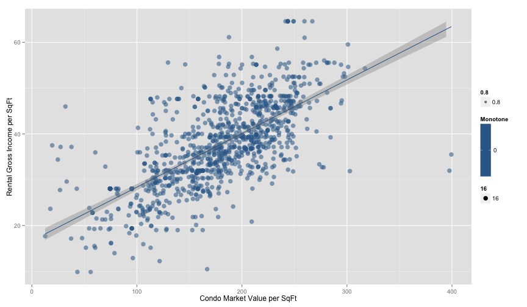
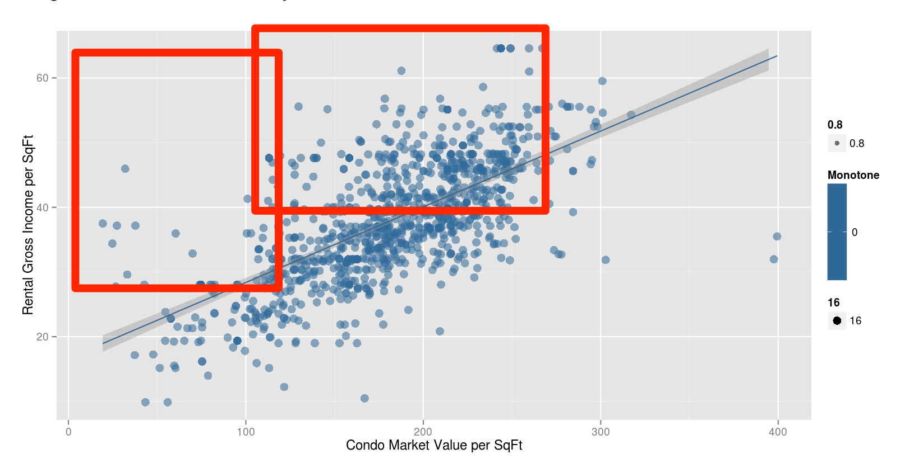
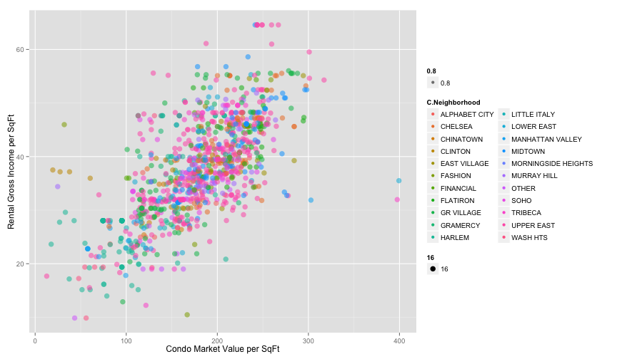

Realestate Market Analysis in Manhattan
========================================================
author: Kiichi Takeuchi
date: 11/23/2014

Motivation
========================================================

How do we find the best ROI (Return of Investment) realestate in Manhattan? 

- Higher Rental Gross Income (=Rental Gross Income per SqFt)
- Lower Market Value (=Condo Market Value per SqFt)

Any other related factors?

- By Neighborhood?
- By Classification?
- By Year Built?

Data Source: NYC Open Data DOF Condominium Comparable Rental Income

Data Processing and Visualization
========================================================
After applying data cleansing processes, such as fixing long column name, collapsing multiple regions, and removing outliers. ggplot2 is used for graphing library.

 

Visualization
========================================================
Possible Good Investments: Relatively low price v.s high return

Colorizing by Neighborhood
========================================================
 

- By Expense
- By Units
- By Classifications

Find anything interesting? Try different filters and color options.

